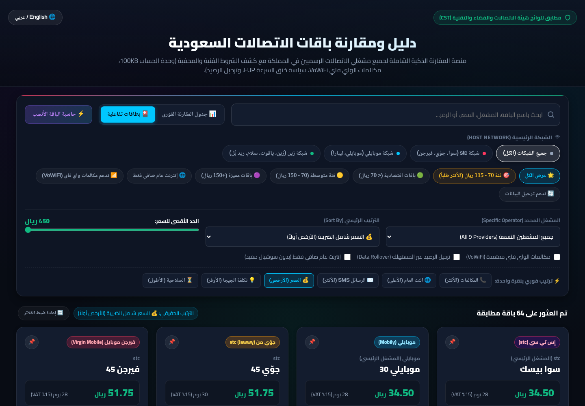
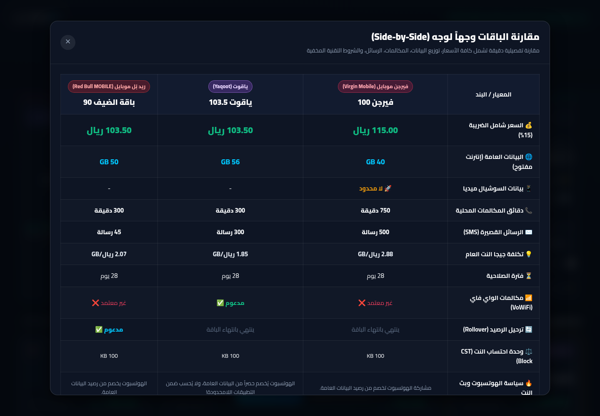
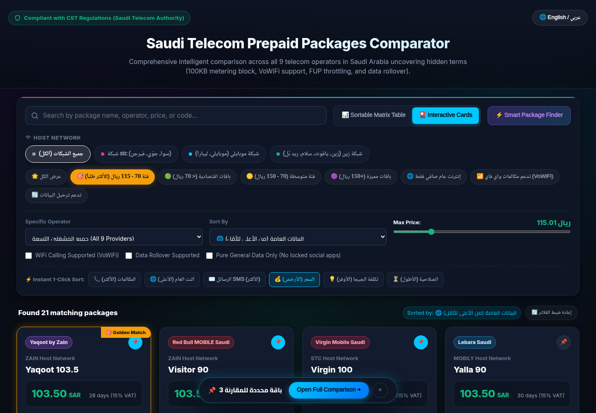

# دليل ومقارنة باقات الاتصالات السعودية | Saudi Telecom Packages

منصة ويب تفاعلية حديثة وشاملة لمقارنة جميع باقات مسبق الدفع (شحن) لمشغلي الاتصالات التسعة في المملكة العربية السعودية، مستخرجة ومحققة مباشرة من المواقع الرسمية ولوائح هيئة الاتصالات والفضاء والتقنية (CST).


---

## ✨ المميزات الرئيسية (Key Features)

1. **نظام عرض مزدوج (Dual-View System):**
   - **📊 جدول المقارنة الفوري (Sortable Matrix Table):** عرض مضغوط وعالي الكثافة لجميع الباقات (64 باقة) مع رأس جدول ثابت وفرز تفاعلي بنقرة واحدة على أي عمود.
   - **🎴 عرض البطاقات العصرية (Modern Cards Grid):** بطاقات تفاعلية بتصميم داكن فاخر، أشرطة بيانية لتوزيع البيانات، شبكة إحصائيات مصغرة، وقائمة قابلة للطي للشروط المخفية.
2. **فرز متعدد المعايير (Multi-Column Sorting):**
   - 📞 دقائق المكالمات (من الأكثر للأقل / من الأقل للأكثر).
   - ✉️ الرسائل القصيرة SMS (فرز دقيق لعدد الرسائل المضمنة).
   - 🌐 البيانات العامة (GB).
   - 💰 السعر شامل الضريبة (15%).
   - 💡 تكلفة الجيجا العام الصافي (الأوفر اقتصادياً).
   - 📊 إجمالي البيانات (العامة + السوشيال).
   - ⏳ فترة الصلاحية.
3. **كشف الشروط التقنية والمخفية (Hidden Terms Uncovered):**
   - وحدة احتساب البيانات الإلزامية (100 KB block).
   - دعم مكالمات الواي فاي (VoWiFi) الرسمية.
   - سياسة بث الإنترنت والهوتسبوت (Hotspot).
   - سياسة الاستخدام العادل وخنق السرعة (FUP).
   - ترحيل الرصيد غير المستهلك (Data Rollover / Gigacoins).
4. **أداة المقارنة المباشرة وجهاً لوجه (Side-by-Side Comparator):**
   - إمكانية تثبيت (Pin 📌) حتى 4 باقات ومقارنتها في جدول تحليلي فوري.
5. **حاسبة الاحتياج الذكية (Smart Recommendation Calculator):**
   - اقتراح فوري لأفضل وأوفر باقة بناءً على حجم البيانات العامة والميزانية الشهرية.
6. **دعم كامل للغتين:**
   - واجهة عربية أصيلة (RTL) مع إمكانية التبديل الفوري للإنجليزية (LTR).

---

## 📸 لقطات من المنصة (Screenshots)

| جدول المقارنة الفوري (Table View) | عرض البطاقات التفاعلية (Cards View) |
| :---: | :---: |
|  |  |

| المقارنة وجهاً لوجه (Comparison Modal) | الواجهة الإنجليزية (English LTR) |
| :---: | :---: |
|  |  |

---

## 📁 هيكلية المشروع (Project Structure)

```
saudi-telecom-packages/
├── index.html                     # واجهة المنصة التفاعلية
├── style.css                      # التصميم الداكن الفاخر والأنماط الانسيابية
├── app.js                         # محرك المعالجة، الفلترة، والفرز
├── packages.json                  # قاعدة بيانات JSON الكاملة لجميع الباقات والشروط
├── hidden_terms_guide.md          # الدليل الفني للشروط المخفية ولوائح CST
├── comparison_70_115_sar.md       # تقرير تحليلي متخصص لفئة 70 - 115 ريال
├── assets/                        # لقطات الشاشة والمعاينات البصرية
├── generate_app_js.py             # سكربت تحديث وتوليد app.js مع قاعدة البيانات
├── verify_app.js                  # اختبارات التحقق الآلية عبر Chromium
└── providers/                     # توثيق تفصيلي لكل مشغل على حدة
    ├── stc.md                     # إس تي سي (سوا)
    ├── jawwy.md                   # جوّي من stc
    ├── virgin.md                  # فيرجن موبايل (شبكة stc)
    ├── mobily.md                  # موبايلي
    ├── lebara.md                  # ليبارا (شبكة موبايلي)
    ├── zain.md                    # زين السعودية
    ├── yaqoot.md                  # ياقوت (شبكة زين)
    ├── salam.md                   # سلام موبايل (شبكة زين)
    └── redbull.md                 # ريد بُل موبايل (شبكة زين)
```

---

## 🌐 المشغلون والشبكات المشمولة (9 مشغلين)

1. **شبكة stc:**
   - [stc (سوا)](providers/stc.md) - المشغل الرئيسي
   - [جوّي (Jawwy)](providers/jawwy.md) - علامة رقمية
   - [فيرجن موبايل (Virgin)](providers/virgin.md) - مشغل افتراضي MVNO
2. **شبكة موبايلي:**
   - [موبايلي (Mobily)](providers/mobily.md) - المشغل الرئيسي
   - [ليبارا (Lebara)](providers/lebara.md) - مشغل افتراضي MVNO
3. **شبكة زين:**
   - [زين (Zain)](providers/zain.md) - المشغل الرئيسي
   - [ياقوت (Yaqoot)](providers/yaqoot.md) - علامة رقمية
   - [سلام موبايل (Salam)](providers/salam.md) - مشغل افتراضي MVNO
   - [ريد بُل موبايل (Red Bull)](providers/redbull.md) - مشغل افتراضي MVNO

---

## 🚀 التشغيل والتطوير المحلي

المنصة مصممة بدون أي مكتبات خارجية ثقيلة (Zero external dependencies). يمكنك تشغيلها محلياً:

```bash
# الانتقال لمجلد المشروع
cd saudi-telecom-packages

# تشغيل خادم محلي خفيف
python3 -m http.server 8080
```
ثم فتح المتصفح على: `http://localhost:8080`

---

## 📜 الترخيص ومصادر البيانات
* البيانات مستخرجة من المواقع الرسمية لمشغلي الاتصالات ولوائح هيئة الاتصالات والفضاء والتقنية (CST).
* رخصة مفتوحة المصدر (MIT License) - للاستخدام الشخصي والتطوير.
