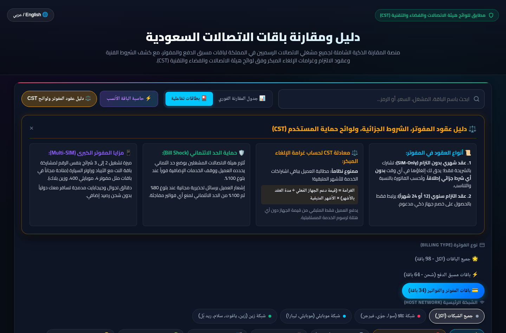
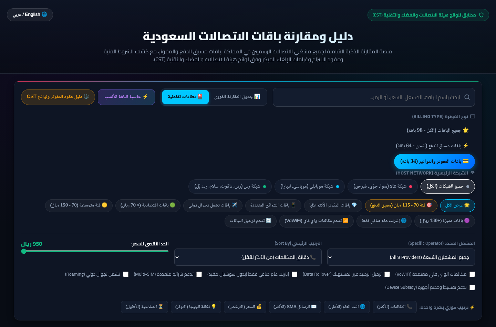
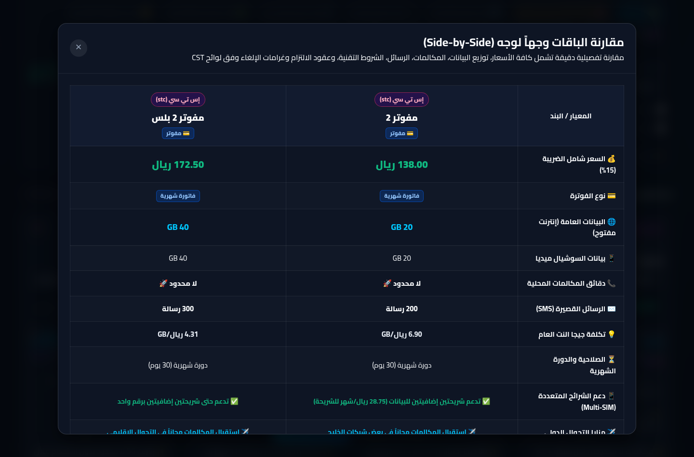
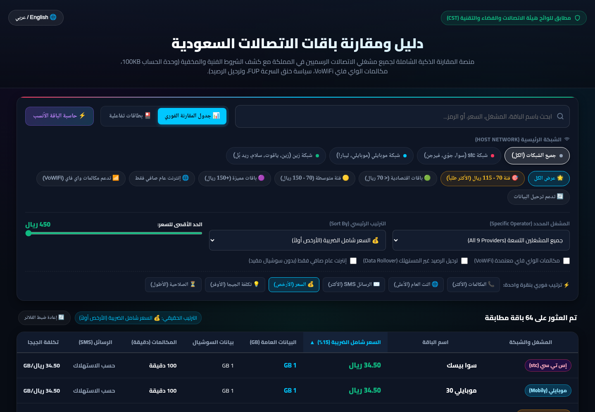

# دليل ومقارنة باقات الاتصالات السعودية | Saudi Telecom Packages

منصة ويب تفاعلية حديثة وشاملة لمقارنة جميع باقات مسبق الدفع (شحن) والمفوتر (عقود وفواتير شهرية) لمشغلي الاتصالات التسعة في المملكة العربية السعودية (98 باقة)، مستخرجة ومحققة مباشرة من المواقع الرسمية ولوائح هيئة الاتصالات والفضاء والتقنية (CST).

🔗 **المنصة المباشرة (Live Demo):** [https://telecom.ayman.lat](https://telecom.ayman.lat)  
📦 **مستودع جيت هب (GitHub Repository):** [https://github.com/me3bk/saudi-telecom-packages](https://github.com/me3bk/saudi-telecom-packages)



---

## ✨ المميزات الرئيسية (Key Features)

1. **قاعدة بيانات شاملة (98 باقة رسمية):**
   - **64 باقة مسبقة الدفع (شحن):** تغطي جميع الفئات الاقتصادية من 30 إلى 450 ريال.
   - **34 باقة مفوتر (عقود وفواتير):** تشمل باقات مفوتر stc، مفوتر موبايلي، زين بلاك، سلام، ياقوت، جوّي، وريد بُل.
   - فلترة فورية حسب نوع الفوترة: (الكل 98 | مسبق الدفع 64 | المفوتر 34).

2. **⚖️ دليل عقود المفوتر ولوائح حماية المستخدم (CST Guide):**
   - شرح شفاف لحقوق المشترك وعقود الالتزام الشهرية (بدون التزام) والسنوية (12/24 شهراً).
   - **معادلة غرامة الإلغاء المبكر النظامية:** توضيح الحظر الصارم لمطالبة العميل برسوم الخدمة للأشهر المتبقية، وحصر الغرامة فقط في:
     $$\text{الغرامة} = \left(\frac{\text{قيمة دعم الجهاز الفعلي}}{\text{مدة العقد بالأشهر}}\right) \times \text{الأشهر المتبقية}$$
   - **حماية الحد الائتماني (Bill Shock):** آلية الإيقاف الإجباري عند 100% ورسائل التنبيه الاستباقية عند 80%.
   - **مزايا الشرائح المتعددة (Multi-SIM):** باقات تدعم حتى 3 شرائح بنفس الرقم لاقتسام البيانات مع الأجهزة اللوحية والسيارة مجاناً.
   - **فلاتر المفوتر المتقدمة:** فلترة خاصة لباقات الشرائح المتعددة، باقات التجوال الدولي، وباقات دعم الأجهزة الذكية.

3. **نظام عرض مزدوج متقدم (Dual-View System):**
   - **📊 جدول المقارنة الفوري (Sortable Matrix Table):** رأس جدول ثابت وفرز تفاعلي بنقرة واحدة على أي عمود.
   - **🎴 عرض البطاقات العصرية (Modern Cards Grid):** بطاقات تفاعلية بتصميم داكن فاخر، أشرطة بيانية لتوزيع البيانات، شارات المفوتر والشحن، وقائمة قابلة للطي للشروط المخفية.

4. **فرز متعدد المعايير (Multi-Column Sorting):**
   - 📞 دقائق المكالمات (من الأكثر للأقل / من الأقل للأكثر).
   - ✉️ الرسائل القصيرة SMS (فرز دقيق لعدد الرسائل المضمنة).
   - 🌐 البيانات العامة (GB).
   - 💰 السعر شامل الضريبة (15%).
   - 💡 تكلفة الجيجا العام الصافي (الأوفر اقتصادياً).
   - 📊 إجمالي البيانات (العامة + السوشيال).
   - ⏳ فترة الصلاحية ودورة الفاتورة.

5. **كشف الشروط التقنية والمخفية (Hidden Terms Uncovered):**
   - وحدة احتساب البيانات الإلزامية (100 KB block).
   - دعم مكالمات الواي فاي (VoWiFi) الرسمية.
   - سياسة بث الإنترنت والهوتسبوت (Hotspot).
   - سياسة الاستخدام العادل وخنق السرعة (FUP).
   - ترحيل الرصيد غير المستهلك (Data Rollover / Gigacoins).

6. **أداة المقارنة المباشرة وجهاً لوجه (Side-by-Side Comparator):**
   - إمكانية تثبيت (Pin 📌) حتى 4 باقات ومقارنتها في جدول تحليلي فوري يعرض كافة الفروق والأسعار ومزايا Multi-SIM وشروط العقود.

7. **حاسبة الاحتياج الذكية (Smart Recommendation Calculator):**
   - اقتراح فوري لأفضل وأوفر باقة بناءً على حجم البيانات العامة والميزانية الشهرية.

8. **دعم كامل للغتين:**
   - واجهة عربية أصيلة (RTL) مع إمكانية التبديل الفوري للإنجليزية (LTR).

---

## 📸 لقطات من المنصة (Screenshots)

| دليل عقود المفوتر ولوائح CST | باقات المفوتر والشرائح المتعددة |
| :---: | :---: |
|  |  |

| المقارنة الشاملة وجهاً لوجه | جدول المقارنة الفوري |
| :---: | :---: |
|  |  |

---

## 📁 هيكلية المشروع (Project Structure)

```
saudi-telecom-packages/
├── index.html                     # واجهة المنصة التفاعلية المحدثة (مسبق + مفوتر)
├── style.css                      # التصميم الداكن الفاخر والأنماط الانسيابية المتجاوبة
├── app.js                         # محرك المعالجة والفلترة وقاعدة البيانات المدمجة
├── packages.json                  # قاعدة بيانات JSON الكاملة (98 باقة رسمية)
├── postpaid_contracts_cst_guide.md# الدليل الشامل لعقود المفوتر والشروط الجزائية ولوائح CST
├── hidden_terms_guide.md          # الدليل الفني للشروط المخفية ولوائح CST
├── comparison_70_115_sar.md       # تقرير تحليلي متخصص لفئة 70 - 115 ريال
├── assets/                        # لقطات الشاشة والمعاينات البصرية
├── generate_app_js.py             # سكربت توليد وتحديث app.js مع قاعدة البيانات
├── generate_markdown.py           # سكربت توليد توثيق المشغلين في providers/
└── providers/                     # توثيق تفصيلي لكل مشغل على حدة (شحن ومفوتر)
    ├── stc.md                     # إس تي سي (سوا ومفوتر)
    ├── jawwy.md                   # جوّي من stc
    ├── virgin.md                  # فيرجن موبايل (شبكة stc)
    ├── mobily.md                  # موبايلي (شحن ومفوتر)
    ├── lebara.md                  # ليبارا (شبكة موبايلي)
    ├── zain.md                    # زين السعودية (شباب وبلاك)
    ├── yaqoot.md                  # ياقوت (شبكة زين)
    ├── salam.md                   # سلام موبايل (سولو شحن ومفوتر)
    └── redbull.md                 # ريد بُل موبايل (شبكة زين)
```

---

## 🌐 المشغلون والشبكات المشمولة (9 مشغلين)

1. **شبكة stc:**
   - [stc (سوا)](providers/stc.md) - المشغل الرئيسي
   - [جوّي (Jawwy)](providers/jawwy.md) - علامة رقمية
   - [فيرجن موبايل (Virgin)](providers/virgin.md) - مشغل افتراضي MVNO
2. **شبكة موبايلي:**
   - [موبايلي (Mobily)](providers/mobily.md) - المشغل الرئيسي
   - [ليبارا (Lebara)](providers/lebara.md) - مشغل افتراضي MVNO
3. **شبكة زين:**
   - [زين (Zain)](providers/zain.md) - المشغل الرئيسي
   - [ياقوت (Yaqoot)](providers/yaqoot.md) - علامة رقمية
   - [سلام موبايل (Salam)](providers/salam.md) - مشغل افتراضي MVNO
   - [ريد بُل موبايل (Red Bull)](providers/redbull.md) - مشغل افتراضي MVNO

---

## 🚀 التشغيل والتطوير المحلي

المنصة مصممة بدون أي مكتبات خارجية ثقيلة (Zero external dependencies). يمكنك تشغيلها محلياً:

```bash
# الانتقال لمجلد المشروع
cd saudi-telecom-packages

# تشغيل خادم محلي خفيف
python3 -m http.server 8080
```
ثم فتح المتصفح على: `http://localhost:8080`

---

## 📱 تجربة الهواتف الذكية (Mobile Browser Optimized)
المنصة مهيأة بنسبة 100% للعمل بسلاسة تامة على متصفحات الهواتف الذكية (Safari iOS & Chrome Android):
* **الوضع الافتراضي:** يتم تفعيل عرض البطاقات تلقائياً على شاشات الجوال لسهولة القراءة دون تمرير أفقي.
* **شريط توجيه الجدول:** شريط تنبيه نبضي يساعد المستخدم على سحب الجدول أفقياً بسلاسة عند اختيار وضع الجدول.
* **منع التكبير التلقائي:** ضبط خطوط المدخلات على 16px لتفادي تكبير الشاشة المزعج في أجهزة آيفون.
* **شبكة المشغلين (2x2):** تحويل أزرار الشبكات لاستهلاك أقل مساحة عمودية ممكنة.
* **شريط مقارنة عائم متوافق:** مراعاة الحواف السفلية لشاشات الهواتف (Safe Area Insets) وأزرار لمسية مريحة (44px+).

---

## 📜 الترخيص ومصادر البيانات
* البيانات مستخرجة من المواقع الرسمية لمشغلي الاتصالات ولوائح هيئة الاتصالات والفضاء والتقنية (CST).
* رخصة مفتوحة المصدر (MIT License) - للاستخدام الشخصي والتطوير.
